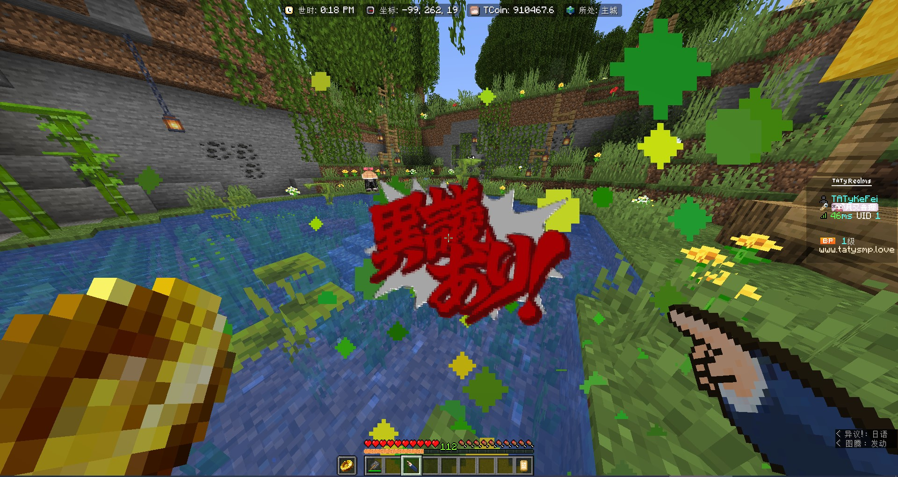

# 简介

这是一个 MC 插件 [Itemsadder](https://www.spigotmc.org/resources/%E2%9C%A8itemsadder%E2%AD%90emotes-mobs-items-armors-hud-gui-emojis-blocks-wings-hats-liquids.73355/) 的扩展包，包含一些有关逆转裁判用来发病的东西

你也可以用来学习，玩的开心~

# 物品属性

| 物品名               | 作用                                 | CMD值     | material         |
| :---                | :---                                 | :---      | :---             |
| 律师微章             | 左右键可触发异议                      | 9000000   | WHITE_DYE        |
| 成不堂龙一的手        | 右键其他玩家对其造成精神攻击(包括自己) | 9000001   | WHITE_DYE        |
| 异议 (效果)          | 用于图腾动画特效，无其他用处           | 9000002   | TOTEM_OF_UNDYING |

# 未来要新增的物品

| 物品                  | 作用                           |
| :---                 | :---                           |
| 御剑怜侍的手          | 触发御剑的异议音效               |

# 声明

本人并没有玩过原著，但是水友想玩我才做的这个包。因此如果有什么错误欢迎提出指正

你可以使用自由二创魔改，请声明来源于此仓库

内容最终版权归 CAPCOM(卡普空)© 公司 所有